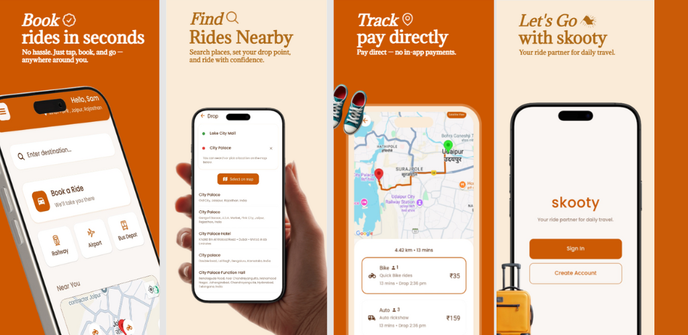

# Skooty Web

Skooty is your trusted ride booking app, making daily commutes and city travel easy, safe, and affordable. Book a ride in seconds, track your driver, and enjoy seamless payments. This is the web landing and info site for the Skooty Rider App.



---

## 🚀 Features
- Instant ride booking
- Live driver tracking
- Secure, cashless payments
- Professional drivers
- 24/7 customer support
- Android app download link
- Terms, Privacy Policy, and Contact pages

---

## 📦 Tech Stack
- **React** (with [Create React App](https://github.com/facebook/create-react-app))
- **React Router** for navigation
- **Tailwind CSS** for styling
- **Jest** & **React Testing Library** for testing

---

## 🛠️ Getting Started

### Prerequisites
- Node.js (v14 or higher recommended)
- npm (v6 or higher)

### Installation
```bash
npm install
```

### Running Locally
```bash
npm start
```
Open [http://localhost:3000](http://localhost:3000) in your browser.

### Building for Production
```bash
npm run build
```

### Running Tests
```bash
npm test
```

---

## 📁 Folder Structure
```
├── public/
│   ├── index.html
│   ├── screenshot.png
│   ├── logo192.png
│   ├── logo512.png
│   └── ...
├── src/
│   ├── App.js
│   ├── App.css
│   ├── index.js
│   ├── index.css
│   ├── Contact.js
│   ├── Terms.js
│   ├── PrivacyPolicy.js
│   ├── App.test.js
│   └── ...
├── package.json
├── tailwind.config.js
└── README.md
```

---

## 📱 Download the App
[](https://play.google.com/store/apps/details?id=com.heylalit.skooty)

---

## 🤝 Contributing
Contributions are welcome! Please open an issue or submit a pull request for improvements or bug fixes.

---

## 📄 License
This project is licensed under the MIT License.

---

## 📬 Contact
For support or inquiries, email: [support@skooty.com](mailto:support@skooty.com)

---

## 📚 Learn More
- [Create React App Documentation](https://facebook.github.io/create-react-app/docs/getting-started)
- [React Documentation](https://reactjs.org/)
- [Tailwind CSS Documentation](https://tailwindcss.com/)
